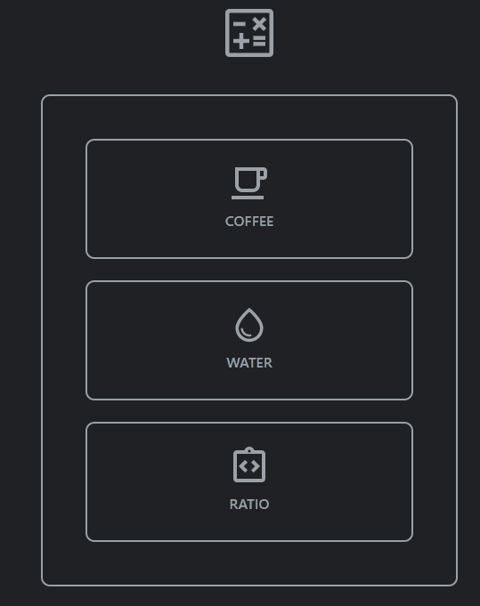

# README

<h1 align="center"> COFFEE RATIO CALCULATOR </h1>

 
    <a href="#sobre">Sobre</a>
    <a href="#funcionalidades">Funcionalidades</a>
    <a href="#tecnologias">Tecnologias</a>
    <a href="#Autor">Autor</a>
 

 # Sobre
 

 
Calculadora de "ratio" para conseguir atingir uma consistencia nas suas receitas

 
Você mesmo pode conferir o projeto clicando nesse <a href="https://yutaronegi.github.io/CoffeeRatioCalculator/">Link</a>

 
O site está 100% em inglês para treinar o meu desenvolvimento com projetos em inglês

 # Funcionalidades 
<ul>
    <li>Calcular a quantidade café</li>
    <li>Calcular a quantidade água</li>
    <li>Calcular ratio</li>
 </ul>

 # Tecnologias
 <ul>
    <li>HTML</li>
    <li>CSS</li>
    <li>Javascript</li>
    <li>Bootstrap</li>
 </ul>

 # Autor

 <ul>
    <li>Yutaro Negi</li>
    <li><a href="https://www.linkedin.com/in/yutaronegi/">Linkedin</a></li>
    <li>(11) 94194-5061</li>
    <li>souza_yutaro@hotmail.com</li>
 </ul>

